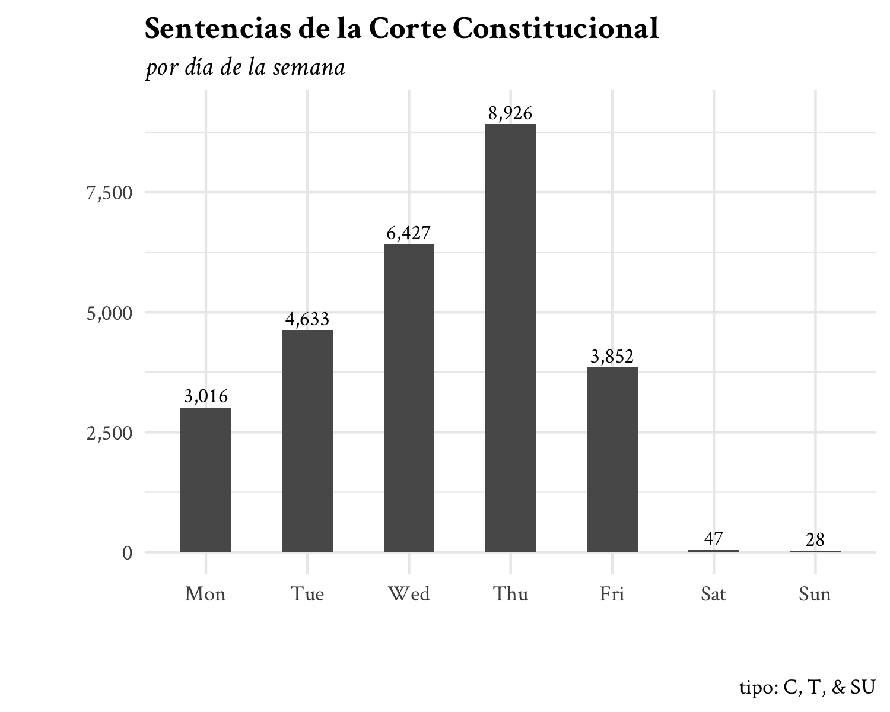

<!-- README.md is generated from README.Rmd. Please edit that file -->

```{r, include = FALSE}
knitr::opts_chunk$set(
  collapse = TRUE,
  comment = "#>",
  fig.align = "center"
)
```

# ccc_datos

<!-- badges: start -->
<!-- badges: end -->

This repository contains the scripts I used for scraping the Colombian Constitutional Court's website.

The `textos/` directory is not included in the repository. It has `r length(dir("textos/"))` documents.

All relevant data will be contained in the `data/` directory.

```{r}
fs::dir_tree("data/")
```

The `seeds.rds` file contains cases that show up in the old search engine when we search for "corte" (court, in Spanish).

The `seeds2.rds` file contains cases that show up in the new search engine when we search for "corte".

The `metadata.rds` file contains all case-level information.

```{r}
dplyr::glimpse(readr::read_rds("data/metadata.rds"))
```


```{r, echo=FALSE}

```


