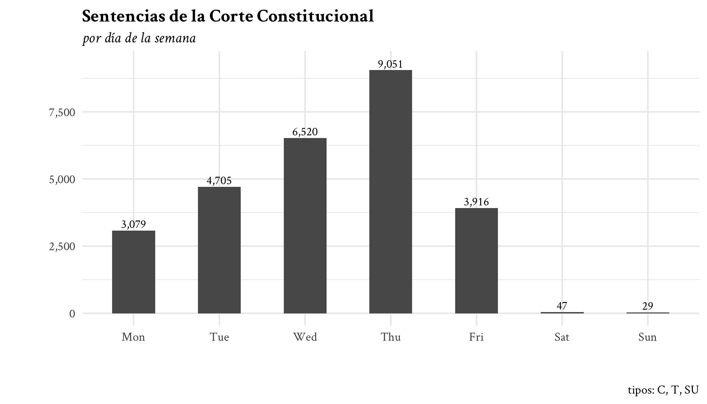

<!-- README.md is generated from README.Rmd. Please edit that file -->

# ccc_datos

<!-- badges: start -->
<!-- badges: end -->

This repository contains the scripts I used for scraping the Colombian
Constitutional Court’s
[website](https://www.corteconstitucional.gov.co/).

The `textos/` directory is not included in the repository. It has 27139
documents.

All relevant data will be contained in the `data/` directory.

``` r
fs::dir_tree("data/")
#> data/
#> ├── citations.rds
#> ├── descriptors.rds
#> ├── metadata.rds
#> ├── seeds.rds
#> ├── seeds2.rds
#> └── seeds3.rds
```

-   `seeds.rds` contains cases that show up in the [old search
    engine](https://www.corteconstitucional.gov.co/relatoria/) when we
    search for “corte” (or *court*, in Spanish).

-   `seeds2.rds` contains cases that show up in the [new search
    engine](https://www.corteconstitucional.gov.co/relatoria/buscador/)
    when we search for “corte,” back in February of 2022. `seeds3.rds`
    contains cases that show up more recently.

-   `metadata.rds` contains all available case-level information.

    ``` r
    glimpse(readr::read_rds("data/metadata.rds"))
    #> Rows: 27,141
    #> Columns: 8
    #> $ id                                 <chr> "T-012-92", "T-001-92", "C-004-92",…
    #> $ type                               <chr> "T", "T", "C", "T", "T", "C", "T", …
    #> $ year                               <int> 1992, 1992, 1992, 1992, 1992, 1992,…
    #> $ date                               <date> 1992-02-25, 1992-04-03, 1992-05-07…
    #> $ tipo                               <chr> "Tutela", "Tutela", "Constitucional…
    #> $ resumen                            <chr> NA, NA, NA, NA, NA, NA, NA, NA, NA,…
    #> $ ponentes                           <list> "José Gregorio Hernández Galindo",…
    #> $ salvamentos_y_aclaraciones_de_voto <list> NA, NA, NA, NA, NA, NA, NA, NA, NA…
    ```

-   `citations.rds` contains the edge list of citations.

    ``` r
    el <- read_rds("data/citations.rds")
    glimpse(el)
    #> Rows: 986,181
    #> Columns: 6
    #> $ from      <chr> "C-001-18", "C-001-18", "C-001-18", "C-001-18", "C-001-18", …
    #> $ to        <chr> "C-458-15", "C-135-17", "C-042-17", "C-390-17", "C-1235-05",…
    #> $ from_year <int> 2018, 2018, 2018, 2018, 2018, 2018, 2018, 2018, 2018, 2018, …
    #> $ to_year   <int> 2015, 2017, 2017, 2017, 2005, 2005, 2005, 2005, 2005, 1996, …
    #> $ from_date <date> 2018-01-24, 2018-01-24, 2018-01-24, 2018-01-24, 2018-01-24,…
    #> $ to_date   <date> 2015-07-22, 2017-03-01, 2017-02-01, 2017-06-14, 2005-11-29,…
    ```

    Note that some cases cite other cases multiple times.

    ``` r
    count(el, from, to, sort = TRUE) |> head(n = 10)
    #> # A tibble: 10 × 3
    #>    from      to           n
    #>    <chr>     <chr>    <int>
    #>  1 SU-214-16 C-577-11   257
    #>  2 C-088-20  C-355-06   228
    #>  3 C-080-18  C-007-18   211
    #>  4 C-080-18  C-674-17   181
    #>  5 SU-096-18 C-355-06   152
    #>  6 T-388-13  T-153-98   149
    #>  7 C-077-17  C-644-12   133
    #>  8 T-444-14  C-577-11   124
    #>  9 T-109-19  C-258-13   121
    #> 10 SU-575-19 C-258-13   119
    ```

-   `descriptors.rds` contains the edge list of
    citations-to-descriptors.

    ``` r
    descriptors <- read_rds("data/descriptors.rds")
    glimpse(descriptors)
    #> Rows: 96,776
    #> Columns: 2
    #> $ from <chr> "C-001-18", "C-001-18", "C-002-18", "C-002-18", "C-002-18", "C-00…
    #> $ to   <chr> "COSA JUZGADA CONSTITUCIONAL", "COSA JUZGADA CONSTITUCIONAL FORMA…
    ```

    These can be used to find relevant “rights”, “principles”, and other
    relevant stuff.

    ``` r
    descriptors |> 
      filter(str_detect(to, "DERECHO")) |> 
      count(to, sort = TRUE)
    #> # A tibble: 803 × 2
    #>    to                                         n
    #>    <chr>                                  <int>
    #>  1 DERECHO A LA SALUD                      1680
    #>  2 DERECHO DE PETICION                     1098
    #>  3 DERECHO A LA IGUALDAD                    548
    #>  4 DERECHO A LA EDUCACION                   497
    #>  5 DERECHO A LA SEGURIDAD SOCIAL            486
    #>  6 DERECHO AL MINIMO VITAL DEL TRABAJADOR   445
    #>  7 DERECHOS FUNDAMENTALES                   315
    #>  8 DERECHO AL MINIMO VITAL DEL PENSIONADO   308
    #>  9 DERECHO AL MINIMO VITAL                  284
    #> 10 DERECHO A LA VIDA                        258
    #> # … with 793 more rows

    descriptors |> 
      filter(str_detect(to, "PRINCIPIO")) |> 
      count(to, sort = TRUE)
    #> # A tibble: 308 × 2
    #>    to                                                                          n
    #>    <chr>                                                                   <int>
    #>  1 PRINCIPIO DE IGUALDAD                                                     298
    #>  2 PRINCIPIO DE UNIDAD DE MATERIA                                            237
    #>  3 PRINCIPIO DE SUBSIDIARIEDAD DE LA ACCION DE TUTELA                        193
    #>  4 PRINCIPIO DE SUBSIDIARIEDAD E INMEDIATEZ EN LA ACCION DE TUTELA           157
    #>  5 PRINCIPIO PRO ACTIONE EN DEMANDA DE INCONSTITUCIONALIDAD                  153
    #>  6 PRINCIPIO DE CONTINUIDAD EN EL SERVICIO DE SALUD                          140
    #>  7 PRINCIPIO DE INMEDIATEZ                                                   133
    #>  8 PRINCIPIO DE SUBSIDIARIEDAD COMO REQUISITO DE PROCEDIBILIDAD DE LA ACC…   127
    #>  9 PRINCIPIO DE LA BUENA FE                                                  122
    #> 10 ACCION DE TUTELA Y PRINCIPIO DE INMEDIATEZ                                104
    #> # … with 298 more rows
    ```

------------------------------------------------------------------------


